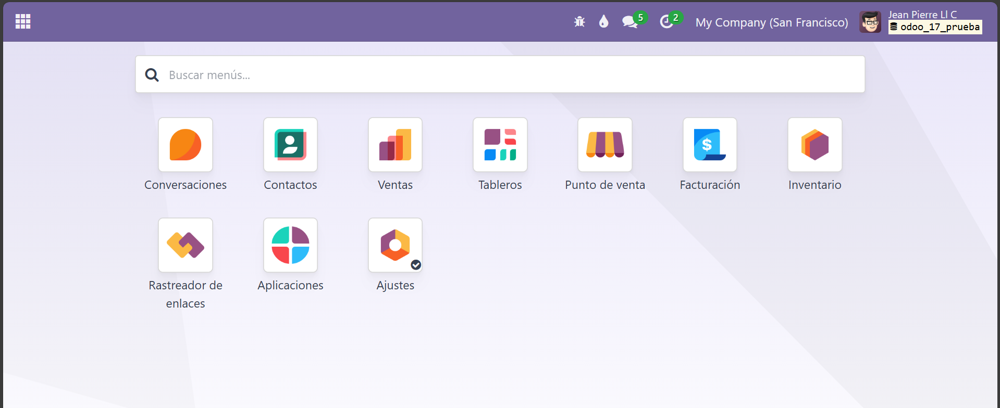
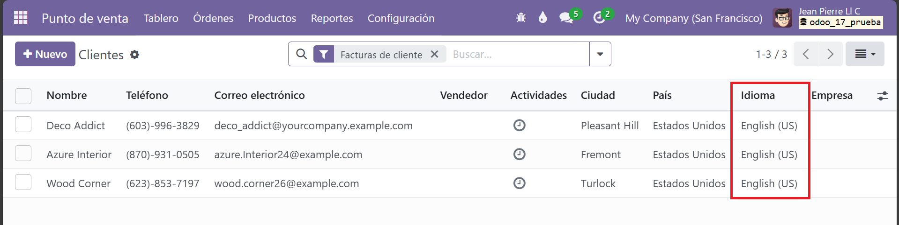
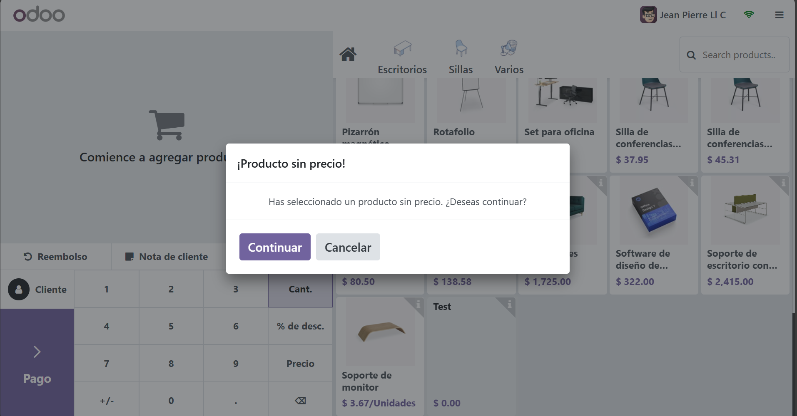
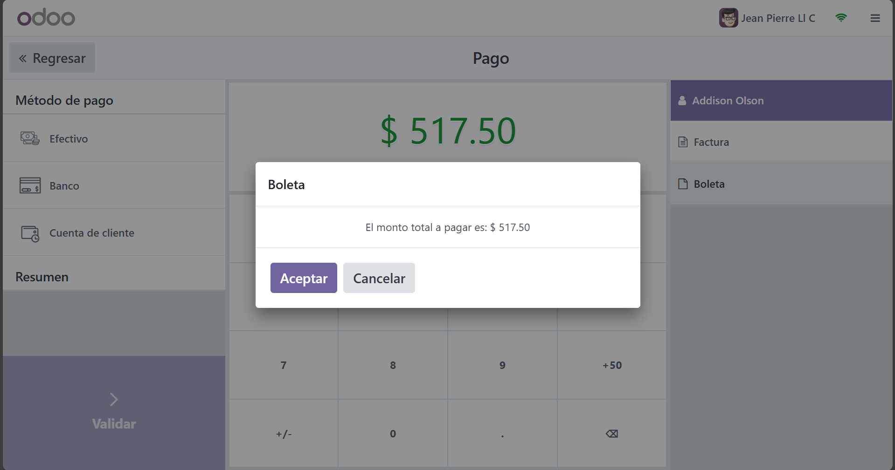
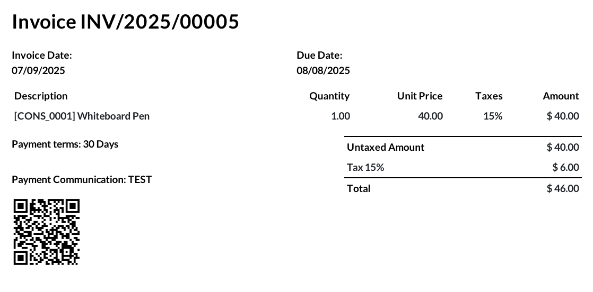
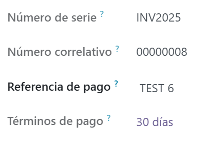
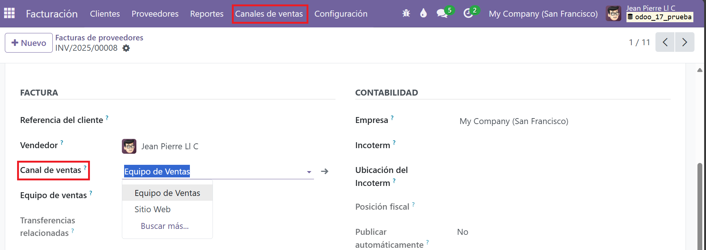
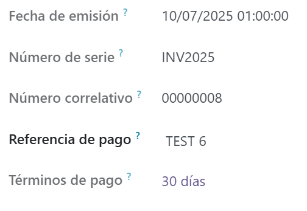
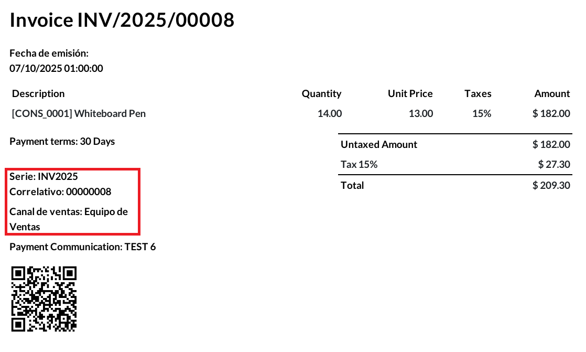
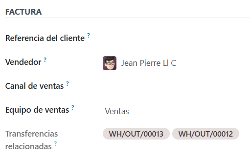

## Vista general

Esta es mi prueba técnica en donde se incorporan una serie de modificaciones que simplifican el día a día de quienes usan Odoo en ventas y facturación.Todos estos ejercicios fueron realizados en Odoo 17 community.

---

### 1. Idioma visible en la lista de clientes  
  
Ahora, cuando abres la lista de clientes en el Punto de Venta, ves una columna extra que muestra el idioma preferido de cada persona.

---

### 2. Alerta de precio cero  
  
Si alguien intenta vender un producto cuyo precio está en $ 0.00, aparece un aviso inmediato. Esto evita regalar artículos por error y protege la caja sin interrumpir el flujo de venta.

---

### 3. Botón «Boleta» con total a pagar  
  
En la pantalla de cobro del POS verás un nuevo botón llamado **Boleta**. Al tocarlo se abre una ventanita que muestra el monto total que debe pagar el cliente.

---

### 4. QR en la factura  
  
Las facturas impresas llevan un código QR que contiene los datos esenciales (número, cliente, fecha, cantidades y total). Con él, cualquiera puede escanear y revisar la información clave al instante.

---

### 5. Serie y correlativo separados  
  
El número de factura ahora se divide en **Serie** (ej. INV2025) y **Correlativo** (ej. 00000008). Así es más fácil referirse a los documentos y llevar un control ordenado.

---

### 6. Canal de ventas al alcance  
  
Justo debajo del nombre del vendedor aparece un nuevo campo: **Canal de ventas**. Sirve para clasificar la factura (equipo de ventas, sitio web, etc.).

---

### 7. Fecha y hora de emisión  
  
El campo «Fecha de factura» se ocultó y fue reemplazado por **Fecha de emisión**, que incluye tanto la fecha como la hora exacta. De esta forma el registro refleja con precisión cuándo se emitió el documento, útil para auditorías y plazos legales.

---

### 8. Datos clave en el PDF  
  
Los cambios de los puntos 5, 6 y 7 (serie, correlativo, canal y fecha/hora) se muestran igualmente en la versión impresa o PDF de la factura.

---

### 9. Transferencias asociadas  
  
Cada factura luce un recuadro con todas las transferencias de almacén vinculadas al pedido que la generó. Esto facilita rastrear los movimientos de salida.

